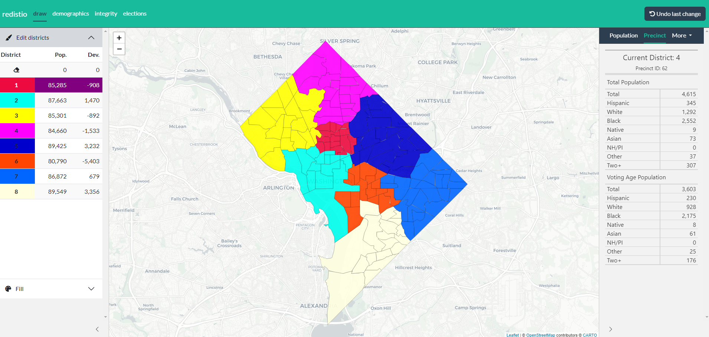

<!-- README.md is generated from README.Rmd. Please edit that file -->

```{r, include = FALSE}
knitr::opts_chunk$set(
  collapse = TRUE,
  comment = "#>",
  fig.path = "man/figures/README-",
  out.width = "100%"
)
```

# redistio <a href="http://www.christophertkenny.com/redistio/"></a>


<!-- badges: start -->
[](https://github.com/christopherkenny/redistio/actions/workflows/R-CMD-check.yaml)
<!-- badges: end -->

`redistio` provides a point-and-click districting interface powered by [Shiny](https://shiny.posit.co/) and [Leaflet](https://leafletjs.com/). For regular `sf` objects, it can be used to draw districts and export assignment files. For `redist_map` objects, algorithmic assistance is enabled for map drawing.

## Installation

You can install the development version of `redistio` from [GitHub](https://github.com/) with:

``` r
pak::pkg_install('christopherkenny/redistio')
```

## Example

The most basic application of `redistio` starts with an `sf` tibble and a column of district assignments.

```r
library(redistio)

draw(dc, dc$ward)
```



