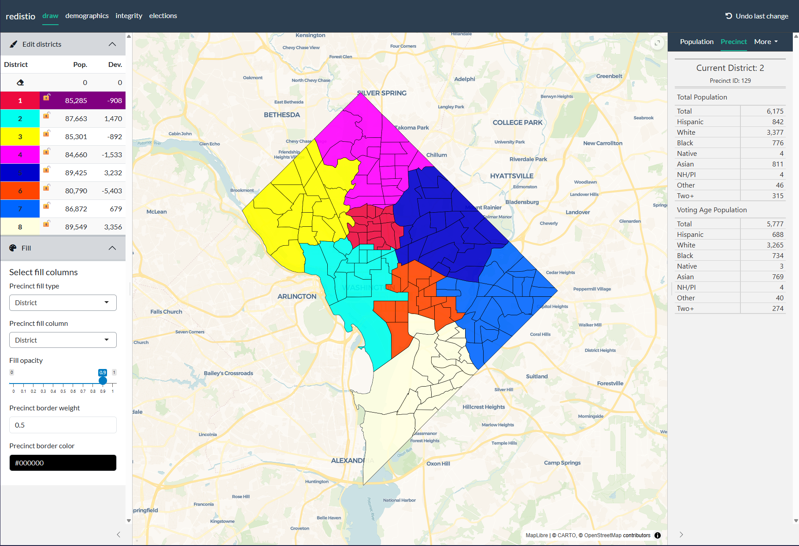

# redistio

`redistio` provides a point-and-click districting interface powered by
[Shiny](https://shiny.posit.co/) and
[mapgl](https://github.com/walkerke/mapgl). For regular `sf` objects, it
can be used to draw districts and export assignment files. For
`redist_map` objects, algorithmic assistance is enabled for map drawing.
It also includes an interactive adjacency graph editor via
[`adj_editor()`](http://www.christophertkenny.com/redistio/reference/adj_editor.md).

## Installation

You can install the development version of `redistio` from
[GitHub](https://github.com/) with:

``` r
pak::pak('christopherkenny/redistio')
```

Or from [R-universe](https://christopherkenny.r-universe.dev/) with:

``` r
install.packages('redistio', repos = c('https://christopherkenny.r-universe.dev', 'https://cloud.r-project.org'))
```

## Example

The most basic application of `redistio` starts with an `sf` tibble and
a column of district assignments.

``` r
library(redistio)

draw(dc, dc$ward)
```



## Plans Browser and Comparisons

When working with `redist_map` objects and `redist_plans`, you can pass
pre-computed plans to
[`draw()`](http://www.christophertkenny.com/redistio/reference/draw.md)
for browsing and comparison. This enables two additional tabs in the
app:

- **Plans**: Browse and preview simulated plans on the map, and adopt
  any plan as your current working plan.
- **Comparisons**: Compare your current plan against the simulated plans
  using summary statistics and plots.

``` r
library(redistio)
library(redist)

map <- redist_map(dc, existing_plan = ward)
plans <- redist_smc(map, nsims = 100)

draw(map, init_plan = map$ward, plans = plans, plans_fn = add_plan_stats)
```

The `plans_fn` argument accepts a function that adds the current plan to
the `redist_plans` object and computes summary statistics for
comparison. The built-in
[`add_plan_stats()`](http://www.christophertkenny.com/redistio/reference/add_plan_stats.md)
function handles this automatically, computing statistics like
population parity, compactness, partisan metrics, and administrative
splits to match whatever columns are present in `plans`.

## Adjacency Editor

`redistio` includes an interactive adjacency graph editor for fixing
adjacency issues in your data (e.g., removing edges across rivers or
adding edges for missing connections):

``` r
library(redistio)

adj_editor(dc, init_plan = dc$ward)
```

The editor lets you add or remove edges by clicking pairs of precincts,
and provides an export tab with an edit log and reproducible code using
`geomander` functions.

# Configuration

## Editor options

The editor can be configured primarily through
[`redistio_options()`](http://www.christophertkenny.com/redistio/reference/redistio_options.md).
Some configurable options:

- `theme`: the [bslib](https://rstudio.github.io/bslib/) theme to use
- `panels`: which panels to include. Allows for removing panels like
  `elections`, if drawing districts in a party-blind manner
- `palette_party`: the colors to use for partisan maps
- `palette_pop`: the colors to use for population maps
- `palette_pct`: the colors to use for percentage maps. Diverging
  palettes are recommended.
- `map_tiles`: the base map style function to use from
  [mapgl](https://walker-data.com/mapgl/reference/index.html#styling-helpers)
- `use_algorithms`: whether to enable algorithmic assistance for map
  drawing. Requires a `redist_map` object.
- `alg_max_districts`: the maximum number of districts allowed in
  algorithmic simulations
- `alg_max_sims`: the maximum number of simulations allowed in
  algorithmic simulations
- `use_plans`: whether to show the plans browser tab when `plans` is
  provided to
  [`draw()`](http://www.christophertkenny.com/redistio/reference/draw.md)
- `use_comparisons`: whether to show the comparisons tab when `plans`
  and `plans_fn` are provided to
  [`draw()`](http://www.christophertkenny.com/redistio/reference/draw.md)
- `use_planscore`: whether to use the [PlanScore
  API](https://planscore.org/) to evaluate plans. Requires internet
  access and a PlanScore key.
- `locked_districts`: districts to lock at app start, preventing edits
  to those districts
- `projection`: the Maplibre map projection to use (default is
  `'mercator'`)

## Data Dependent Options

Several data-based options may be configured inside
[`draw()`](http://www.christophertkenny.com/redistio/reference/draw.md):

- `layers`: Columns to use as toggle layers, where you can show things
  like county lines above the shapes
- `elect_cols`: Specify election columns directly. This use a guessing
  approach which follows the ALARM Project column naming schema by
  default.
- `demog_cols`: Specify demographic columns directly. This use a
  guessing approach which follows the ALARM Project column naming schema
  by default.
- `split_cols`: Specify columns which contain administrative units to
  check splits for.
- `hover_fn`: A function to display precinct-data based on the row of
  `shp` that the mouse is over.
- `plans`: A `redist_plans` object for browsing and comparison.
- `plans_fn`: A function to add a reference plan and compute summary
  statistics (e.g.,
  [`add_plan_stats()`](http://www.christophertkenny.com/redistio/reference/add_plan_stats.md)).
